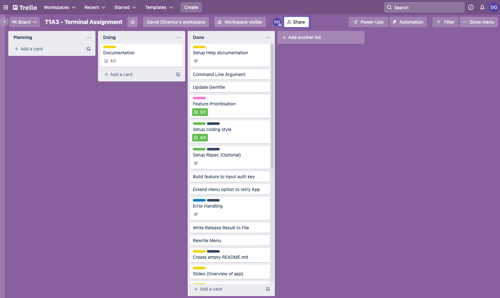

# Discogs Digger App

### A tool to find rare and obscure music releases on the [Discogs](https://www.discogs.com/) database.

### repo: [https://github.com/DavidOliverius/DiggerApp](https://github.com/DavidOliverius/DiggerApp)
---
## Authentication:
IMPORTANT - A personal access token is required to search using the Discogs API.

**Discogs Digger** will prompt you for it when first started. Make sure you have it handy.

You can generate yours here: [https://www.discogs.com/settings/developers](https://www.discogs.com/settings/developers)

---
## Install/Setup:

Make sure you have Ruby installed. In your terminal run:
```
$ ruby -v
```
To check what version of Ruby you have installed on your machine. macOS releases since El Capitan [should have](https://www.ruby-lang.org/en/documentation/installation/#:~:text=Homebrew%20(macOS),El%20Capitan%20(10.11).) a version of Ruby already installed.

Once you have confirmed that Ruby is installed, [download](https://github.com/DavidOliverius/DiggerApp/archive/refs/heads/main.zip) this repository to your local machine.

In your terminal, navigate to the root folder where `digger.rb` is located. 

If you do not have [Bundler](https://bundler.io/) installed, use:
```
$ gem install bundler
```

Ensure that gem dependencies are installed using:
```
$ bundle install
```

Once the gems are installed - to execute the program, simply use:
```
$ ruby digger.rb
```
### Command Line Arguments:
There are also some command line arguments available to use.

To print the contents of your log file to the terminal directly:
```
$ ruby digger.rb -log
```
To input/change your personal access token:
```
$ ruby digger.rb -token YOUR_PERSONAL_TOKEN
```
### Shell Script:
It is also possible to run the program using a shell script `digger.sh` from the same directory
```
$ ./digger.sh
```
The same **Command Line Arguments** are available via `digger.sh` using the same syntax.

## Dependencies/System Requirements:
- **Ruby 2.7.5**
- **macOS Monterey**

This was developed using Ruby version 2.7.5 on a Macbook running macOS Monterrey.

I cannot guarantee it will work on any previous version.


## Features:

### Discogs Lookup + Algorithm:
Using the [Discogs Wrapper](https://github.com/buntine/discogs) for accessing the Discogs API in Ruby, users have a choice of multiple genres of electronic music (up to three), as well as the choice of year of release. 

Using the user's input, the Discogs Digger will search the database, finding the total number of results and sort them by most collected on Discogs. 

Then, a simple algorithm uses the total number of results to pick one at random. 

It will pick a release from the last three quarters of the results, based upon the logic that the first quarter of results are likely to be well known releases.

### Looped menu for repeated searches:
Once the user has completed a search, they will be given the option to start a new search from the beginning, or search with the same parameters and find another random release. 

This enables easy and rapid reusability of the algorithm if a user has a specific genre/year in mind when searching.

### User Authentication for Discogs:
Searching the Discogs API requires a user token that is bound to a personal account on the Discogs website. 

On startup, the user will be prompted to input their personal access token that they can generate for free on Discogs.

### Write to log file:
Every time a search is completed, the formatted output is both displayed on screen in the Terminal AND written into a text file log `user/digger_log.txt` with a time stamp. 

This allows users to keep a long running record of all their search results. Included in the formatted output is a link to the specific Discogs page in question, making it easy for users to investigate the release and have a listen.

## Implementation Plan:
Used Trello to plan and mark progress when building the program.

A screenshot from the end of the project:



## Style Guide:
Following the [Ruby Style Guide](https://rubystyle.guide/) and using [Rubocop](https://rubocop.org/) to enforce styling.
